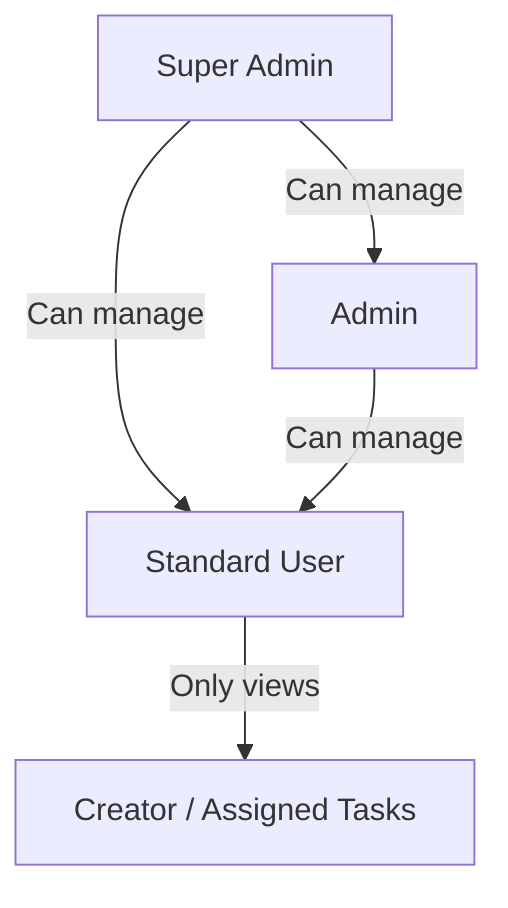
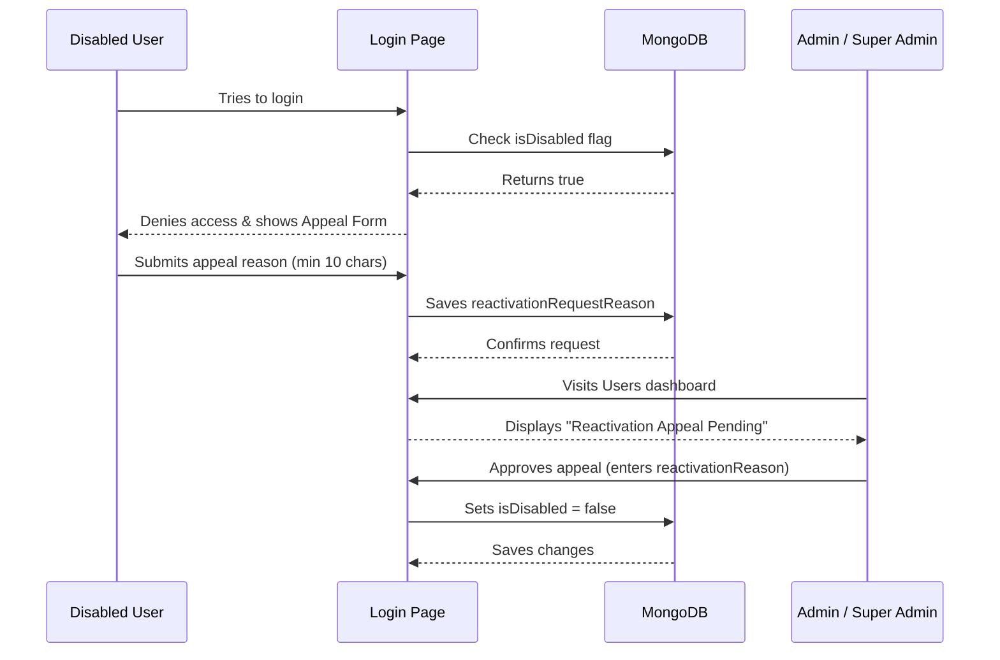

# TaskFlow - Collaborative Task Management System

TaskFlow is a modern, collaborative task management web application designed with a React frontend and an Express/Mongoose backend. It incorporates role-aware user workspaces, interactive analytics dashboards, light/dark themes, accessibility best practices, and a comprehensive user-deactivation appeal workflow.

---

## Table of Contents
1. [Project Overview](#project-overview)
2. [Tech Stack & Dependencies](#tech-stack--dependencies)
3. [Prerequisites](#prerequisites)
4. [Installation & Setup](#installation--setup)
   - [Backend Configuration](#backend-configuration)
   - [Frontend Configuration](#frontend-configuration)
5. [Seeding & Demo Credentials](#seeding--demo-credentials)
6. [Running the Application](#running-the-application)
7. [Database & Schema Overview](#database--schema-overview)
8. [Comprehensive Role & User Guide](#comprehensive-role--user-guide)
   - [Access Level Hierarchy](#access-level-hierarchy)
   - [Super Admin Workflow](#super-admin-workflow)
   - [Admin Workflow](#admin-workflow)
   - [Standard User Workflow](#standard-user-workflow)
   - [Account Lock & Reactivation Appeal Workflow](#account-lock--reactivation-appeal-workflow)
9. [Email Service Configuration (Brevo)](#email-service-configuration-brevo)
10. [API Endpoints Reference](#api-endpoints-reference)
11. [Deployment Guide](#deployment-guide)

---

## Project Overview
TaskFlow allows organizations to assign, organize, and monitor tasks. Key application features include:
*   **Role-Based Workspaces**: Users see dashboards and task scopes customized to their roles.
*   **Analytics Dashboard**: Visual representation of tasks with SVG Donut Charts and progress tracking by Priority (Low, Medium, High) and Status (Open, In Progress, Testing, Completed).
*   **Account Controls & appeals**: Admins can lock/disable accounts. Disabled users are blocked at login and can submit structured appeals to reactivate their accounts.
*   **Theme & Accessibility (a11y)**: Light and dark modes with high-contrast visible focus rings, keyboard navigability, and ARIA attributes.
*   **Instant Contextual Feedback**: Context-driven notifications for all actions.

---

## Tech Stack & Dependencies

### Frontend (`/frontend`)
*   **Framework**: Vite + React 19 + TypeScript 6
*   **State Management**: React Query v5 (`@tanstack/react-query`)
*   **Forms & Validation**: `react-hook-form` + `zod`
*   **Styling**: Tailwind CSS v4
*   **Iconography**: `lucide-react`

### Backend (`/backend`)
*   **Platform**: Node.js + TypeScript 5 + Express
*   **Database**: MongoDB + Mongoose ODM
*   **Authentication**: JSON Web Tokens (JWT) + bcryptjs password hashing
*   **Mailing**: `nodemailer` (SMTP) + `fetch` (Brevo HTTP API)

---

## Prerequisites
*   Node.js (v20 or higher recommended)
*   MongoDB (local instance running on port 27017 or a MongoDB Atlas URI)
*   npm (v10 or higher)

---

## Installation & Setup

Clone the repository and follow the step-by-step setup guides below:

### Backend Configuration

1. Navigate to the `backend/` directory:
   ```bash
   cd backend
   ```
2. Install dependencies:
   ```bash
   npm install
   ```
3. Configure the environment variables:
   Copy `.env.example` to `.env`:
   ```bash
   copy .env.example .env
   ```
   Open `.env` and configure the following variables:
   ```ini
   PORT=5000
   MONGO_URI=mongodb://localhost:27017/taskflow  # Replace with Atlas URI if needed
   JWT_SECRET=supersecretjwtsecretkeytaskflow2026
   JWT_EXPIRES_IN=15m
   JWT_REFRESH_SECRET=supersecretrefreshjwtsecretkeytaskflow2026
   JWT_REFRESH_EXPIRES_IN=7d
   CLIENT_URL=http://localhost:5173              # CORS origin whitelist
   
   # Email Configurations (Brevo API or SMTP)
   BREVO_EMAIL_MODE=smtp                         # Options: api | smtp
   BREVO_API_KEY=your-brevo-api-or-smtp-key
   BREVO_SENDER_EMAIL="FlowNop <no-reply@flownop.com>"
   ```

### Frontend Configuration

1. Navigate to the `frontend/` directory:
   ```bash
   cd ../frontend
   ```
2. Install dependencies:
   ```bash
   npm install
   ```
3. Configure the environment variables:
   Copy `.env.example` to `.env`:
   ```bash
   copy .env.example .env
   ```
   Configure the API connection URL:
   ```ini
   VITE_API_URL=http://localhost:5000/api
   ```

---

## Seeding & Demo Credentials

To populate your database with pre-configured accounts, categories, and tasks, run the seed script from the `backend/` directory:

```bash
cd backend
npm run seed
```

This creates the following pre-configured user credentials for you to explore the workflows:

| Role | Name | Email | Password | Details |
| :--- | :--- | :--- | :--- | :--- |
| **Super Admin** | Super Admin | `superAdminFlowNop@gmail.com` | `FlowNop#2026` | Auto-seeded on first server boot. Fully protected account. |
| **Admin** | System Admin | `admin@taskflow.com` | `Password123` | Can view all tasks and disable/activate standard users. |
| **Standard User**| Alice Smith | `alice@taskflow.com` | `Password123` | Normal standard user workflow. |
| **Standard User**| Bob Jones | `bob@taskflow.com` | `Password123` | Normal standard user workflow. |

---

## Running the Application

### Local Development Mode

Start both backend and frontend concurrently in your local dev terminal:

#### 1. Start the Backend API Server
```bash
cd backend
npm run dev
```
*   The API server will launch at `http://localhost:5000`.
*   Check the server's health status at `http://localhost:5000/api/health`.

#### 2. Start the Frontend Client
```bash
cd frontend
npm run dev
```
*   The Vite development server will launch the client application at `http://localhost:5173`.

### Production Build & Launch

#### 1. Compile & Build Backend (TypeScript to JavaScript)
```bash
cd backend
npm run build
npm start
```

#### 2. Compile & Build Frontend (Static Assets)
```bash
cd frontend
npm run build
npm run preview
```

---

## Database & Schema Overview

TaskFlow relies on a structured MongoDB database managed through Mongoose:
*   **User Schema (`User.ts`)**: Stores core profile credentials, profile data (name, email, phone, birthday, address, employee EID), deactivation statuses (`isDisabled`, `disabledReason`, `disabledAt`), and appeal logs (`reactivationRequested`, `reactivationRequestReason`).
*   **Task Schema (`Task.ts`)**: Stores task status parameters, assigned owners, creator timestamps, and comments for tracking completion status.

---

## Comprehensive Role & User Guide

TaskFlow structures access controls into three roles to establish clear boundaries for team management.

### Access Level Hierarchy



---

### Super Admin Workflow

The Super Admin (`superAdminFlowNop@gmail.com`) acts as the top-level organization controller.

*   **Exclusive Permissions**:
    *   **Manage Admins**: Only the Super Admin can create new Admin profiles, disable existing Admin accounts, or reactivate disabled Admin profiles.
    *   **Immunity**: The default Super Admin account cannot be disabled or deleted by any user in the system.
*   **Common Workflows**:
    1.  **Promoting Staff**: Navigate to the **Users** tab, click **Add User**, and select the **Admin** role to create a new administrator account.
    2.  **Suspending Admins**: If an Admin leaves the team, the Super Admin goes to the user row, clicks **Disable**, and enters the reason for suspension.

---

### Admin Workflow

Administrators run day-to-day operations and team assignment.

*   **Permissions**:
    *   **Task Visibility**: Can see and modify all tasks created by any user in the system.
    *   **User Workspace**: Accesses the global **Users** workspace page to create new users, review account details, and manage standard accounts.
    *   **Standard Account Lockdown**: Can disable and reactivate standard User accounts.
    *   **Guarded Boundaries**: Admins cannot access or modify other Admin accounts.
*   **Common Workflows**:
    1.  **Assigning Tasks**: Click **Create Task**, fill out details, choose a priority, and select a standard User from the assignee list.
    2.  **Auditing Teams**: Visit the **Users** dashboard to check if any user accounts need suspension or activation.

---

### Standard User Workflow

Standard Users focus entirely on task execution.

*   **Registration Restrictions**:
    *   New users can sign up using the Registration page. 
    *   **Validation Rules**: Users must enter a valid birthday showing they are **at least 18 years old** to successfully register.
*   **Permissions**:
    *   **Scoped Visibility**: Standard Users can *only* see tasks that they created or that are explicitly assigned to them. They have no access to the general users list or other team members' private tasks.
    *   **Task Updates**: Can change task statuses (e.g. move from `Open` to `Testing`) and leave updates.
*   **Common Workflows**:
    1.  **Managing Private Tasks**: View tasks assigned to you on the dashboard.
    2.  **Updating Work Status**: Complete a task and move it to `Testing` or `Completed`, notifying the creator.

---

### Account Lock & Reactivation Appeal Workflow

When an account is suspended, TaskFlow enforces a recovery process:



---

## Email Service Configuration (Brevo)

TaskFlow supports a flexible email notifier service powered by **Brevo (formerly Sendinblue)**. The server automatically selects its mode based on the environment variables provided in `.env`:

### 1. REST API Mode (Recommended for Render.com)
*   **How to Activate**: Set `BREVO_EMAIL_MODE=api` (the default) and configure `BREVO_API_KEY` to a REST API key generated in the Brevo console (starts with **`xkeysib-`**).
*   **Why it is recommended**: It makes requests over standard HTTPS (port 443). Production environments like Render block outgoing SMTP ports (587, 465, etc.). REST API mode bypasses this limitation.

### 2. SMTP Relay Mode (For Local/Traditional Server Environments)
*   **How to Activate**: Set `BREVO_EMAIL_MODE=smtp` and configure `BREVO_SMTP_PASSWORD` with your Brevo SMTP key (starts with **`xsmtpsib-`**). 
*   **Parameters**:
    *   `BREVO_SMTP_HOST` (default: `smtp-relay.brevo.com`)
    *   `BREVO_SMTP_PORT` (default: `2525`)
    *   `BREVO_SMTP_USER` (your Brevo login email)

*Note: For security reasons, the email service will automatically fall back to **Simulation mode** (logging emails to the console instead of sending them) if configuration variables are missing or incorrect.*

---

## API Endpoints Reference

All endpoint requests are prefixed with `/api`.

| Endpoint | Method | Authentication | Description |
| :--- | :--- | :--- | :--- |
| `/health` | `GET` | Public | System uptime, database connectivity, and email server status. |
| `/auth/register` | `POST` | Public | Signs up a new user (enforces min 18 years validation). |
| `/auth/login` | `POST` | Public | Signs in a user and returns authentication tokens. |
| `/auth/request-reactivation` | `POST` | Public | Submits a reactivation appeal for locked accounts. |
| `/auth/me` | `GET` | JWT Protected | Returns logged-in user profile details. |
| `/users` | `GET` | JWT + Admin | Returns list of all users. |
| `/users/:id/disable` | `POST` | JWT + Admin | Disables an account (Admins cannot disable other Admins). |
| `/users/:id/reactivate` | `POST` | JWT + Admin | Re-enables a suspended account. |
| `/tasks` | `GET` | JWT Protected | Returns user-scoped tasks list. |
| `/tasks` | `POST` | JWT Protected | Creates a new task. |
| `/tasks/:id` | `PATCH` | JWT Protected | Updates task attributes. |

---

## Deployment Guide

### Frontend Deployment (Netlify)
The frontend contains a `netlify.toml` file to resolve React SPA routing redirects.
1. Connect your repository to Netlify.
2. Select `frontend` as the **Base directory**.
3. Set **Build command** to `npm run build` and **Publish directory** to `dist`.
4. Set the `VITE_API_URL` environment variable pointing to your deployed backend URL.

### Backend Deployment (Render)
The backend contains a `render.yaml` blueprint configuration.
1. Connect your repository to Render as a **Blueprint**.
2. Render will automatically parse the blueprint configuration, set up the node environment, and request `MONGO_URI`, `BREVO_API_KEY`, and `BREVO_SENDER_EMAIL` environment variables.
3. Once configured, Render will build and start the API server automatically.
