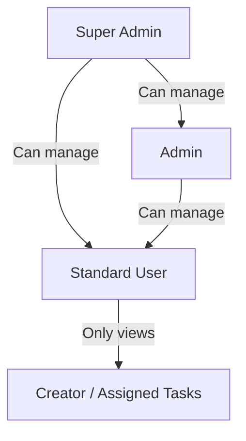
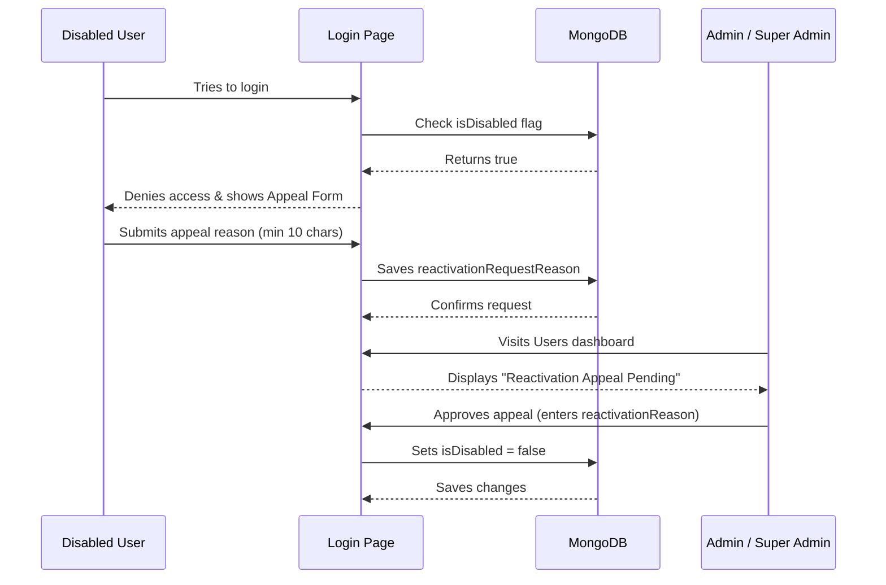

# TaskFlow - Collaborative Task Management System

TaskFlow is a modern, collaborative task management web application designed with a React frontend and an Express/Mongoose backend. It incorporates role-aware user workspaces, interactive analytics dashboards, light/dark themes, accessibility best practices, and a comprehensive user deactivation appeal workflow.

---

## Table of Contents
1. Project Overview
2. Tech Stack and Dependencies
3. Prerequisites
4. Installation and Setup
   - Backend Configuration
   - Frontend Configuration
5. Seeding and Demo Credentials
6. Running the Application
7. Database and Schema Overview
8. Comprehensive Role and User Guide
   - Access Level Hierarchy
   - Super Admin Workflow
   - Admin Workflow
   - Standard User Workflow
   - Account Lock and Reactivation Appeal Workflow
9. Email Service Configuration (Brevo)
10. API Endpoints Reference
11. Deployment Guide

---

## Project Overview
TaskFlow allows organizations to assign, organize, and monitor tasks. Key application features include:
- <b>Role-Based Workspaces</b>: Users see dashboards and task scopes customized to their roles.
- <b>Analytics Dashboard</b>: Visual representation of tasks with SVG Donut Charts and progress tracking by Priority (Low, Medium, High) and Status (Open, In Progress, Testing, Completed).
- <b>Account Controls and Appeals</b>: Admins can lock/disable accounts. Disabled users are blocked at login and can submit structured appeals to reactivate their accounts.
- <b>Theme and Accessibility (a11y)</b>: Light and dark modes with high-contrast visible focus rings, keyboard navigability, and ARIA attributes.
- <b>Instant Contextual Feedback</b>: Context-driven notifications for all actions.

### Latest Task Management Layout Updates
- <b>All Tasks Section Details</b>: In the All Tasks section, the Actions column (containing the View button) has been completely removed from both the In Progress and Approved Tasks tables.
- <b>Task Description Column</b>: A new Description column has been added to the All Tasks list table view. This column displays a truncated preview of the task description, and hovering over it displays the full description in a tooltip.
- <b>All Tasks Card Details</b>: In All Tasks card view, the View Details button is hidden, and the task description is cleanly displayed directly on the card.
- <b>Disabled Assignment Safeguard</b>: Admin users are blocked from assigning tasks (both as primary assignees or sub-assignees) to deactivated/disabled user accounts.

---

## How the System Works

The system allows users to register by filling out a sign-up form. After registration, users can log in to the system using their email and password. If a user forgets their password, they can use the "Forgot Password" option to receive a password reset link via email, supported by an integrated email service.

The system includes role-based access with three main roles: Super Admin, Admin, and Standard User.

- <b>The Super Admin</b> has the highest level of control. They can create admin accounts and manage all users in the system. Super Admin can also assign tasks to standard users and view all tasks created by admins. In addition, Super Admin has the authority to approve any task in the system. When a Super Admin approves a task, it is marked as "Super Admin Approved" and also appears in the respective admin's approved task view with an "Approved By" field showing the Super Admin as the approver. Super Admin can also disable both admin and standard user accounts.
- <b>Admins</b> can manage standard users and assign tasks to them. Admins can also disable standard users. However, if an admin is disabled, they will not be able to create or approve tasks. Only active admins can perform task management operations.
- <b>Standard users</b> receive tasks assigned by admins or the Super Admin. They can work on tasks, update progress, and mark tasks as completed once finished. After completion, tasks must be approved either by the assigned admin or the Super Admin before being considered fully approved.

The system organizes tasks in a role-based manner. Users see only their own tasks, admins see tasks related to their assigned users, and the Super Admin can view all tasks in the system. Additionally, there is a separate "All Tasks" tab that displays every task for monitoring and oversight purposes.

The application allows users to switch between Light Mode and Dark Mode, as well as see their profile information. This structure ensures proper task flow, accountability, and hierarchical approval control across the system.

---

## Tech Stack and Dependencies

### Frontend (/frontend)
- <b>Framework</b>: Vite + React 19 + TypeScript 6
- <b>State Management</b>: React Query v5 (@tanstack/react-query)
- <b>Forms and Validation</b>: react-hook-form + zod
- <b>Styling</b>: Tailwind CSS v4
- <b>Iconography</b>: lucide-react

### Backend (/backend)
- <b>Platform</b>: Node.js + TypeScript 5 + Express
- <b>Database</b>: MongoDB + Mongoose ODM
- <b>Authentication</b>: JSON Web Tokens (JWT) + bcryptjs password hashing
- <b>Mailing</b>: nodemailer (SMTP) + fetch (Brevo HTTP API)

---

## Prerequisites
- Node.js (v20 or higher recommended)
- MongoDB (local instance running on port 27017 or a MongoDB Atlas URI)
- npm (v10 or higher)

---

## Installation and Setup

Clone the repository and follow the step-by-step setup guides below:

### Backend Configuration

1. Navigate to the backend directory:
   ```bash
   cd backend
   ```
2. Install dependencies:
   ```bash
   npm install
   ```
3. Configure the environment variables:
   Copy .env.example to .env:
   ```bash
   copy .env.example .env
   ```
   Open .env and configure the following variables:
   ```ini
   PORT=5000
   MONGO_URI=mongodb://localhost:27017/taskflow  # Replace with Atlas URI if needed
   JWT_SECRET=supersecretjwtsecretkeytaskflow2026
   JWT_EXPIRES_IN=15m
   JWT_REFRESH_SECRET=supersecretrefreshjwtsecretkeytaskflow2026
   JWT_REFRESH_EXPIRES_IN=7d
   CLIENT_URL=http://localhost:5173              # CORS origin whitelist
   
   # Email Configurations (Brevo API or SMTP)
   BREVO_EMAIL_MODE=smtp                         # Options: api | smtp
   BREVO_API_KEY=your-brevo-api-or-smtp-key
   BREVO_SENDER_EMAIL="FlowNop <no-reply@flownop.com>"
   ```

### Frontend Configuration

1. Navigate to the frontend directory:
   ```bash
   cd ../frontend
   ```
2. Install dependencies:
   ```bash
   npm install
   ```
3. Configure the environment variables:
   Copy .env.example to .env:
   ```bash
   copy .env.example .env
   ```
   Configure the API connection URL:
   ```ini
   VITE_API_URL=http://localhost:5000/api
   ```

---

## Seeding and Demo Credentials

To populate your database with pre-configured accounts, categories, and tasks, run the seed script from the backend directory:

```bash
cd backend
npm run seed
```

This creates the following pre-configured user credentials for you to explore the workflows:

| Role | Name | Email | Password | Details |
| :--- | :--- | :--- | :--- | :--- |
| <b>Super Admin</b> | Super Admin | superAdminFlowNop@gmail.com | FlowNop#2026 | Auto-seeded on first server boot. Fully protected account. |
| <b>Admin</b> | System Admin | admin@taskflow.com | Password123 | Can view all tasks and disable/activate standard users. |
| <b>Standard User</b>| Alice Smith | alice@taskflow.com | Password123 | Normal standard user workflow. |
| <b>Standard User</b>| Bob Jones | bob@taskflow.com | Password123 | Normal standard user workflow. |

---

## Running the Application

### Local Development Mode

Start both backend and frontend concurrently in your local dev terminal:

#### 1. Start the Backend API Server
```bash
cd backend
npm run dev
```
- The API server will launch at http://localhost:5000.
- Check the server health status at http://localhost:5000/api/health.

#### 2. Start the Frontend Client
```bash
cd frontend
npm run dev
```
- The Vite development server will launch the client application at http://localhost:5173.

### Production Build and Launch

#### 1. Compile and Build Backend (TypeScript to JavaScript)
```bash
cd backend
npm run build
npm start
```

#### 2. Compile and Build Frontend (Static Assets)
```bash
cd frontend
npm run build
npm run preview
```

---

## Database and Schema Overview

TaskFlow relies on a structured MongoDB database managed through Mongoose:
- <b>User Schema (User.ts)</b>: Stores core profile credentials, profile data (name, email, phone, birthday, address, employee EID), deactivation statuses (isDisabled, disabledReason, disabledAt), and appeal logs (reactivationRequested, reactivationRequestReason).
- <b>Task Schema (Task.ts)</b>: Stores task status parameters, assigned owners, creator timestamps, and comments for tracking completion status.

---

## Comprehensive Role and User Guide

TaskFlow structures access controls into three roles to establish clear boundaries for team management.

### Access Level Hierarchy



---

### Super Admin Workflow

The Super Admin (superAdminFlowNop@gmail.com) acts as the top-level organization controller.

- <b>Exclusive Permissions</b>:
    - <b>Manage Admins</b>: Only the Super Admin can create new Admin profiles, disable existing Admin accounts, or reactivate disabled Admin profiles.
    - <b>Immunity</b>: The default Super Admin account cannot be disabled or deleted by any user in the system.
- <b>Common Workflows</b>:
    1. <b>Promoting Staff</b>: Navigate to the Users tab, click Add User, and select the Admin role to create a new administrator account.
    2. <b>Suspending Admins</b>: If an Admin leaves the team, the Super Admin goes to the user row, clicks Disable, and enters the reason for suspension.

---

### Admin Workflow

Administrators run day-to-day operations and team assignment.

- <b>Permissions</b>:
    - <b>Task Visibility</b>: Can see and modify all tasks created by any user in the system.
    - <b>User Workspace</b>: Accesses the global Users workspace page to create new users, review account details, and manage standard accounts.
    - <b>Standard Account Lockdown</b>: Can disable and reactivate standard User accounts.
    - <b>Guarded Boundaries</b>: Admins cannot access or modify other Admin accounts.
- <b>Common Workflows</b>:
    1. <b>Assigning Tasks</b>: Click Create Task, fill out details, choose a priority, and select a standard User from the assignee list.
    2. <b>Auditing Teams</b>: Visit the Users dashboard to check if any user accounts need suspension or activation.

---

### Standard User Workflow

Standard Users focus entirely on task execution.

- <b>Registration Restrictions</b>:
    - New users can sign up using the Registration page. 
    - <b>Validation Rules</b>: Users must enter a valid birthday showing they are at least 18 years old to successfully register.
- <b>Permissions</b>:
    - <b>Scoped Visibility</b>: Standard Users can only see tasks that they created or that are explicitly assigned to them. They have no access to the general users list or other team members private tasks.
    - <b>Task Updates</b>: Can change task statuses (e.g. move from Open to Testing) and leave updates.
- <b>Common Workflows</b>:
    1. <b>Managing Private Tasks</b>: View tasks assigned to you on the dashboard.
    2. <b>Updating Work Status</b>: Complete a task and move it to Testing or Completed, notifying the creator.

---

### Account Lock and Reactivation Appeal Workflow

When an account is suspended, TaskFlow enforces a recovery process:



---

## Email Service Configuration (Brevo)

TaskFlow supports a flexible email notifier service powered by Brevo. The server automatically selects its mode based on the environment variables provided in .env:

### 1. REST API Mode (Recommended for Render.com)
- <b>How to Activate</b>: Set BREVO_EMAIL_MODE=api (the default) and configure BREVO_API_KEY to a REST API key generated in the Brevo console (starts with xkeysib-).
- <b>Why it is recommended</b>: It makes requests over standard HTTPS (port 443). Production environments like Render block outgoing SMTP ports (587, 465, etc.). REST API mode bypasses this limitation.

### 2. SMTP Relay Mode (For Local/Traditional Server Environments)
- <b>How to Activate</b>: Set BREVO_EMAIL_MODE=smtp and configure BREVO_SMTP_PASSWORD with your Brevo SMTP key (starts with xsmtpsib-). 
- <b>Parameters</b>:
    - BREVO_SMTP_HOST (default: smtp-relay.brevo.com)
    - BREVO_SMTP_PORT (default: 2525)
    - BREVO_SMTP_USER (your Brevo login email)

Note: For security reasons, the email service will automatically fall back to Simulation mode (logging emails to the console instead of sending them) if configuration variables are missing or incorrect.

---

## API Endpoints Reference

All endpoint requests are prefixed with /api.

| Endpoint | Method | Authentication | Description |
| :--- | :--- | :--- | :--- |
| /health | GET | Public | System uptime, database connectivity, and email server status. |
| /auth/register | POST | Public | Signs up a new user (enforces min 18 years validation). |
| /auth/login | POST | Public | Signs in a user and returns authentication tokens. |
| /auth/request-reactivation | POST | Public | Submits a reactivation appeal for locked accounts. |
| /auth/me | GET | JWT Protected | Returns logged-in user profile details. |
| /users | GET | JWT + Admin | Returns list of all users. |
| /users/:id/disable | POST | JWT + Admin | Disables an account (Admins cannot disable other Admins). |
| /users/:id/reactivate | POST | JWT + Admin | Re-enables a suspended account. |
| /tasks | GET | JWT Protected | Returns user-scoped tasks list. |
| /tasks | POST | JWT Protected | Creates a new task. |
| /tasks/:id | PATCH | JWT Protected | Updates task attributes. |

---

## Deployment Guide

### Frontend Deployment (Netlify)
The frontend contains a netlify.toml file to resolve React SPA routing redirects.
1. Connect your repository to Netlify.
2. Select frontend as the Base directory.
3. Set Build command to npm run build and Publish directory to dist.
4. Set the VITE_API_URL environment variable pointing to your deployed backend URL.

### Backend Deployment (Render)
The backend contains a render.yaml blueprint configuration.
1. Connect your repository to Render as a Blueprint.
2. Render will automatically parse the blueprint configuration, set up the node environment, and request MONGO_URI, BREVO_API_KEY, and BREVO_SENDER_EMAIL environment variables.
3. Once configured, Render will build and start the API server automatically.
